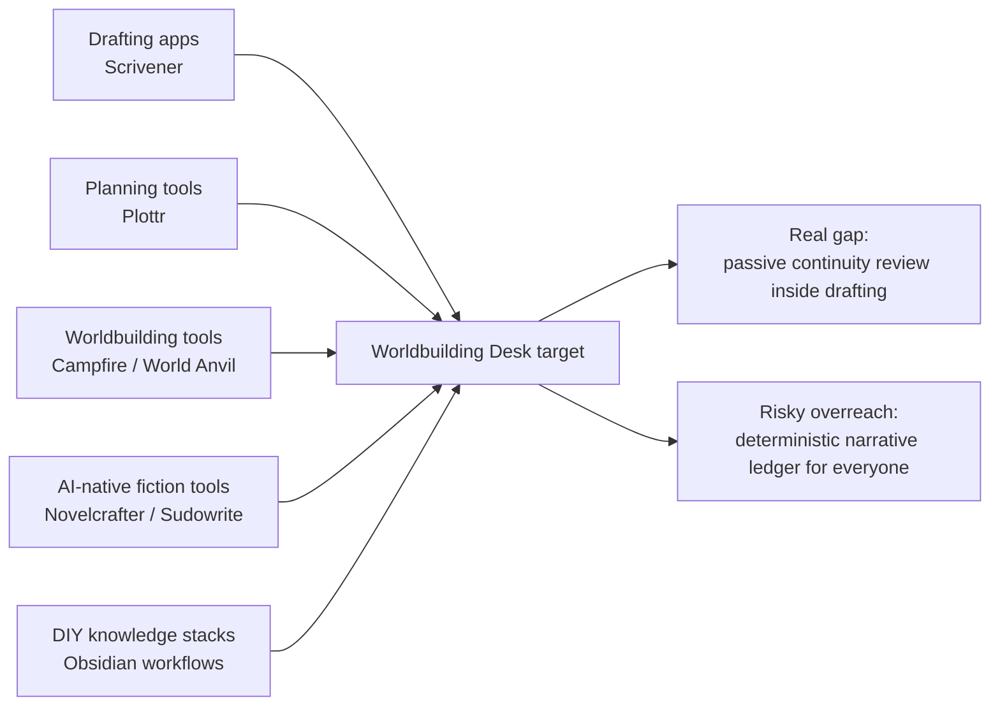
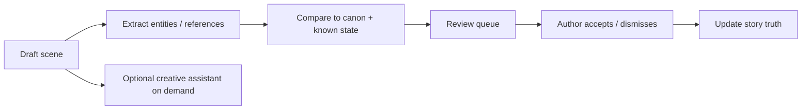
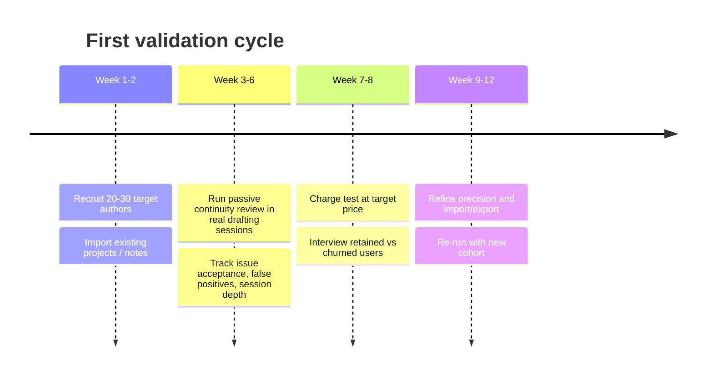

# Worldbuilding Desk Market Analysis

## Executive summary

The uploaded brief describes a writing-first desktop app for fiction authors that keeps drafting central, surfaces canon and continuity help progressively, and treats deterministic review as the eventual source of truth rather than text generation. The current shape already includes a writing workspace, a structured World Bible, character records, review flows for ambiguity and contradictions, planning surfaces, import/export, and author-invoked AI help; the long-term ambition is scene-derived state tracking and deterministic replay. fileciteturn0file0

The core problem is real, but the category is not empty. Multiple existing tools already sell some combination of series bibles, lore organization, continuity context, and writing integration. Scrivener sells long-form drafting and project organization; Plottr sells visual planning plus a series bible; Campfire sells modular writing and worldbuilding; World Anvil sells worldbuilding plus integrated manuscripts; Novelcrafter and Sudowrite both sell “source of truth” story-bible workflows that feed AI context into drafting. That means the opportunity is not “nobody does continuity.” The opportunity is narrower: **low-friction, writing-first, passive continuity review that works during drafting without forcing authors into heavy setup**. citeturn1view0turn29search0turn30search0turn24search1turn5view1turn28view0turn28view1

The strongest initial market is not “all novelists.” It is a smaller but more acute niche: **indie speculative fiction authors writing series fiction, especially LitRPG, progression fantasy, and serialized web fiction**. Those authors face real continuity burden because they manage recurring characters, lore, progression systems, inventory/resources, and fast release cadences. Evidence for the market is indirect but meaningful: U.S. book output is increasingly self-published, fiction was the largest self-published category in 2025, speculative genres are among the top-selling indie genres, and platforms like Royal Road support progression-tagged stories with thousands of followers and seven-figure view counts. citeturn33view0turn20view1turn19view0turn22search1turn23search10turn22search3

The product is at serious risk of being overbuilt. “Deterministic story-state validation” is genuinely differentiated, but for most writers it is not the first buying reason. For the broad novelist market it is likely too abstract, too technical, and too expensive to explain. If built too early, it becomes architecture in search of willingness to pay. The most credible wedge is simpler: **a writing-first workspace that catches continuity errors, unknown entities, and canon drift while you draft**. “Local/private review” is a helpful trust amplifier, especially for unpublished manuscripts, but it is secondary to catching real errors with low false positives. fileciteturn0file0 citeturn9view3turn7view0turn28view1

My bottom-line judgment is: **promising niche business, weak broad platform thesis**. It can work if it is positioned as a continuity-aware drafting tool for series fiction and system-heavy fiction. It likely fails if it is positioned as an all-in-one authoring IDE, a generic AI writing app, or a worldbuilding database with extra features. fileciteturn0file0 citeturn30search0turn39search0turn41view0turn3view4

## What the brief is actually proposing

The brief’s claims and open questions are internally consistent, but they imply two different products hiding inside one roadmap: a **writer workflow product** and a **narrative-state infrastructure product**. That distinction matters because the first is sellable now and the second may only matter to a narrow subset of users. fileciteturn0file0

| From the brief | What it means commercially | My assessment |
|---|---|---|
| Writing workspace stays primary | The tool is competing first with drafting tools, not with wiki tools | Correct instinct. This is the right UX anchor. fileciteturn0file0 |
| Canon, lore, and continuity appear progressively | You are trying to reduce setup burden and planning fatigue | Good wedge if it truly stays passive and non-managerial. fileciteturn0file0 |
| Deterministic validation is the long-term differentiator | You want trustable continuity/state checking beyond fuzzy LLM recall | Real differentiation, but only for a narrower niche at first. fileciteturn0file0 |
| Not a generic AI writing app | You want to avoid the crowded prose-generation market | Necessary. Generic AI writing is already saturated. fileciteturn0file0 |
| LitRPG / progression / system-heavy fiction is a priority | You suspect the highest pain exists where state changes are explicit | Likely true. Also the best place to test deterministic value. fileciteturn0file0 |
| World Bible + review flows already exist | There is already enough product to test the continuity wedge | You do not need the full ledger model to validate demand. fileciteturn0file0 |

The embedded questions in the brief cluster into four decision areas: whether the problem is real, who cares enough to pay, where the architecture is overshooting demand, and what wedge is most legible in go-to-market. Those are the right questions. The report below answers them directly. fileciteturn0file0

## Market map and whether the problem is real

Worldbuilding Desk sits at the intersection of five existing categories: drafting software, worldbuilding databases, visual planning tools, AI-native fiction tools, and do-it-yourself note systems. That intersection is real, but most products today optimize one leg and patch the others. Scrivener is strong at long-form drafting and research organization; Plottr is strong at visual structure; Campfire and World Anvil are strong at modular worldbuilding; Obsidian is strong at local, flexible knowledge management; Novelcrafter and Sudowrite are strong at AI-assisted story context. citeturn1view0turn30search0turn29search0turn24search1turn9view1turn5view1turn28view0

That means the brief is not pursuing a greenfield category. It is pursuing a **better shaped overlap**. The category gap is not “story bible plus writing.” Competitors already claim that. Novelcrafter explicitly markets a codex that shares context across books and feeds AI-assisted writing; Sudowrite markets Story Bible as a source of truth and uses a saliency engine to surface only relevant story context; World Anvil says its manuscript tool is deeply integrated with worldbuilding. citeturn5view1turn5view2turn28view0turn28view1turn41view0

The real unmet need is subtler: most existing tools either require manual upkeep, impose planning structure before drafting, or make continuity support feel like a separate interface instead of something ambient. The brief is directionally right that many authors do not want to “manage a project” before they write. Plottr is explicitly a planning-first tool; Campfire is deliberately modular; Obsidian is powerful but requires assembly; and even AI-native tools still ask users to seed and maintain a story bible. citeturn40view0turn39search0turn9view1turn9view3turn28view0

So: **yes, the problem is real**. Authors do need help keeping details consistent across long projects and series. The persistence of series-bible, codex, and worldbuilding features across competitors is strong market evidence that the pain exists. But **no, the broad category gap is not empty**. The defensible gap is specifically:  
**writing-first drafting + passive continuity review + optional structured lore/state support, with lower setup cost than worldbuilding tools and less prose-generation emphasis than AI writing tools.** citeturn30search0turn39search0turn5view2turn28view0turn28view1

The market timing is better than it would have been a few years ago. Self-published output keeps expanding, fiction remains the biggest self-published category in the Bowker data reported by Publishers Weekly, and both the entity["organization","Authors Guild","us writers association"] and the entity["organization","Alliance of Independent Authors","indie author association"] show a publishing environment in which younger and independent authors are more open to self-publishing, while speculative genres remain commercially meaningful in indie publishing. citeturn33view0turn21view0turn21view1turn19view0turn20view1turn20view0

## Competitive landscape

The most important competitive fact is that users do not compare products feature by feature. They compare **“where do I write?”**, **“where do I store story truth?”**, and **“what have I already learned?”**. Switching costs come from habits, archives, templates, and community workflows as much as from raw feature parity. citeturn1view0turn9view3turn39search0turn40view0turn5view1turn28view0

| Product | Best job | Relevant features | Pricing | Reported traction | Gap relative to Worldbuilding Desk | Threat level |
|---|---|---|---|---|---|---|
| Scrivener | Long-form drafting, binder/research management | Corkboard, outline, research storage, compile/export, drafting-first UX | About $59.99 one-time for macOS/Windows; iOS $23.99; free trial available | Longstanding incumbent; precise current user count not surfaced in official source retrieved | Weak on passive continuity review and deterministic state; strong default for serious novel drafting | **High** for drafting behavior |
| Obsidian workflows | Local-first knowledge base and customizable writing stack | Local Markdown files, no account required, local data ownership, thousands of plugins, optional Sync/Publish | Core app free; Sync $4–$8/mo annual/monthly; Publish $8–$10/mo | Used in 10,000+ organizations; thousands of plugins | Extremely flexible, but continuity support is assembled, not productized; setup burden is high | **High** as DIY substitute |
| Campfire | Modular worldbuilding plus manuscript and publishing | 18 modules, manuscript, encyclopedia, maps, timelines, custom templates, collaboration, self-publishing | Free tier; module pricing from $0.50–$2/mo each; all features $12/mo; lifetime purchases available | Current total user count not disclosed in surfaced sources | Close to your space, but modular complexity makes the “writing-first continuity tool” story harder | **High** partial threat |
| Plottr | Visual outlining and series planning | Timeline, 40+ templates, character sheets, worldbuilding, series bible, collaboration in Pro; “no AI” positioning | $9.99/mo or $60/yr standard; $14.99/mo or $129/yr Pro+; lifetime options | Official pages say “thousands of writers” | Great for planning, not passive drafting review; strongest substitute for planners, not for continuity-on-the-page | **Medium** |
| World Anvil | Public/private worldbuilding, maps, RPG + author workflows | Articles/wiki, maps, timelines, variables, subscribers, manuscripts, monetization, advanced access controls | Free tier; writer-facing paid tiers include Grandmaster at $8.25/mo billed annually and Sage at $25/mo annually | Official traction disclosures are inconsistent: one page says 3M+ users, newer official bios cite 1.5M | Broad, feature-dense, community-heavy; can feel like a worldbuilding platform first and a drafting tool second | **Medium–High** |
| Novelcrafter | AI-assisted novel workflow with integrated codex | Codex/wiki, shared context across books, BYOK AI, scene summarization, character extraction, AI chat, collaboration | $4 / $8 / $14 / $20 per month tiers | Homepage claims 157k+ authors | This is the closest converging “writing-first + context-aware AI” competitor; your edge would be passive non-generative review and deterministic validation | **Very high** |
| Sudowrite | AI-native fiction generation and revision | Story Bible, saliency engine, AI drafting/rewrite, worldbuilding cards, visual planning canvas | Official public pricing exists, but exact tier parsing from indexed official source was incomplete; pricing is clearly subscription/credit-based and materially above pure planning tools | User counts not disclosed in surfaced official sources | Strongest threat if users primarily want help generating or revising prose; weaker if they want reliable continuity checking without creative takeover | **High** but adjacent |
| Lore Forge | Mobile-ready world/story builder with sync | Web app, auto sync, unlimited storage, cross-device use | $5.99/mo in official result snippet | Traction not disclosed | Likely a lighter worldbuilding alternative; less threatening on continuity intelligence | **Low–Medium** |
| Fantasia Archive | Free offline worldbuilding | 100% free, offline, local tool | Free | Traction not disclosed | Strong value anchor against paying for “just a wiki”; weak on integrated drafting/review | **Medium** on price anchoring |

**Source notes:** Scrivener features/pricing citeturn1view0turn0search16turn37view2; Obsidian local-first/pricing/organizations/plugins citeturn9view3turn9view0turn9view4turn8search2; Campfire features/pricing/history citeturn29search0turn39search0turn29search1; Plottr pricing/features/traction/AI posture citeturn40view0turn30search0turn30search10turn30search6; World Anvil features/pricing/traction claims citeturn24search1turn41view0turn26search0turn26search1turn26search9; Novelcrafter features/pricing/traction citeturn5view1turn5view2turn7view0; Sudowrite features/pricing posture citeturn28view0turn28view1turn28view2turn28view3turn3view4; Lore Forge and Fantasia Archive citeturn11search3turn39search1

Two competitive conclusions matter most.

First, **Novelcrafter is the closest product threat** because it already combines writing, codex, cross-book sharing, and AI control in a writing-oriented workflow. If Worldbuilding Desk launches too close to that feature set, it will sound like a narrower Novelcrafter instead of a new category. citeturn5view1turn5view2turn7view0

Second, the biggest substitute is not one product. It is the **patchwork workflow**: a drafter in Scrivener or Word, notes in Obsidian/Notion/Sheets, and ad hoc continuity checking by search, memory, or AI. Novelcrafter explicitly compares itself against Scrivener, Excel/Sheets, and Notion for this reason. That is the actual behavior you have to break. citeturn5view2turn1view0turn9view1

## Users who actually care

The best-fit user is not simply “fantasy writer.” It is the writer for whom continuity mistakes are recurrent, expensive, and emotionally annoying enough to justify a new workflow. The strongest signal is not genre identity by itself. It is **series length, update cadence, state complexity, and how often the author needs to look things up while drafting**. fileciteturn0file0

The table below uses rough size estimates. These are **assumption-driven ranges**, not audited market sizes. I am using public labor data, self-publishing output, author surveys, and observed web-serial/platform signals as directional anchors. citeturn32view0turn33view0turn19view0turn20view1turn22search1turn23search10

| Priority | Persona | Why they care | Rough size estimate | Willingness to pay | Main objections | Deterministic state value |
|---|---|---|---|---|---|---|
| Highest | **System Architect** — LitRPG / progression / system-heavy fiction author | Tracks levels, skills, inventory, resources, class rules, faction states across many chapters or books | **Low thousands to low tens of thousands globally** for serious English-language payers. Assumption: small subset of indie speculative fiction authors, supported by high-engagement Royal Road progression/LitRPG ecosystems rather than broad labor-market counts | **High for the category**: likely $10–$20/mo if it catches real errors; possibly higher later for advanced validation | “I already use spreadsheets/Obsidian/Notion,” “false positives will kill flow,” “I need export and ownership” | **Very high**. This is the segment where deterministic review is not theoretical |
| High | **Series Steward** — indie fantasy/SF author with multi-book canon burden | Needs recurring characters, places, lore, timelines, and cross-book continuity kept straight while drafting | **~25k–75k globally** is a reasonable rough range for serious English-language speculative indie authors. Assumption based on 477k U.S. self-published fiction titles in 2025, 1–3 titles per active author per year, speculative share of the fiction market, and English-market expansion beyond the U.S. | **Moderate**: likely $8–$15/mo or a strong one-time/lifetime offer | “I already own Scrivener,” “I don’t want AI in my manuscript,” “I don’t want to maintain a database” | **Moderate**. Canon review matters more than full state machines |
| Medium | **Serial Sprinter** — Royal Road / web-fiction author publishing fast | Needs consistency under time pressure, especially with comments/fan memory catching contradictions | **~10k–50k globally** for active English-language serial writers is plausible, but low confidence. Royal Road’s active tags and Writathon events show meaningful participation and audience intensity, not precise author counts | **Moderate but price sensitive**: likely $5–$12/mo | “Desktop tool doesn’t fit my publishing stack,” “I need speed more than structure,” “I post from browser/mobile” | **High** when the serial includes explicit systems; otherwise moderate |
| Medium–Low | **Discovery Novelist** — general novelist or pantser | Wants fewer interruptions and less setup, but may not feel the pain strongly enough to switch | **Large market, low urgency**. BLS counts 135,400 U.S. writers/authors, but that is too broad; the relevant paying subsection is much smaller and heterogeneous | **Low–moderate**: often capped near Scrivener/Plottr pricing unless you show clear saved time | “This sounds managerial,” “I do not want software telling me how my story works” | **Low** for most users |
| Low | **Narrative Designer / game writer** | Could use lore/state support, but often works inside studio pipelines and collaborative docs | **Small and fragmented** as a consumer software market | **Medium if studio-approved, low individually** | Procurement, collaboration norms, existing toolchains, lack of consumer buying autonomy | **Mixed**. Potentially useful, but poor wedge for initial GTM |

**Evidence base:** self-publishing expansion and fiction volume citeturn33view0; indie author economics and genre relevance via entity["organization","Alliance of Independent Authors","indie author association"] citeturn19view0turn20view1turn20view0; publishing-mode openness via the entity["organization","Authors Guild","us writers association"] citeturn21view0turn21view1turn21view3; broad writer labor base via the entity["organization","U.S. Bureau of Labor Statistics","federal labor agency"] citeturn32view0; platform intensity on entity["company","Royal Road","web fiction platform"] citeturn22search1turn23search10turn22search3

Three commercial implications follow.

The first is that **LitRPG/progression/system-heavy fiction is your best beachhead even if it is not your whole company**. It has the clearest pain and the most intuitive case for deterministic checking. A good niche wedge beats a vague mass-market promise. fileciteturn0file0 citeturn22search1turn23search10

The second is that **general novelists are a later expansion market, not a launch market**. They are too broad, their pain is less consistent, and their tolerance for “managerial” software is lower. If you launch into that audience, the product will feel more complicated than the problem. citeturn30search0turn40view0turn1view0

The third is that **willingness to pay in this category is bounded by existing software anchors**. Non-generative writing/planning tools cluster roughly from $4 to $15 per month, with some one-time pricing between about $60 and $150, while AI-heavy tools can charge more because they bundle model usage. That implies a continuity-first tool can probably sustain **$8–$15/mo** in the core niche if it proves real saved time and real caught errors; pricing materially above that likely requires premium AI or collaboration/commercial value. citeturn7view0turn9view0turn39search0turn40view0turn0search16turn11search3

## Where the concept is overbuilt and what can fail

The biggest product risk is not competition. It is **mismatch between visible user value and invisible engineering complexity**. The brief’s long-term architecture is sophisticated, but most authors will never buy “deterministic ledger/replay.” They will buy “this catches continuity mistakes before my readers do.” If the engineering roadmap outruns that visible promise, the product becomes overbuilt. fileciteturn0file0

A second risk is category sprawl. The brief is trying to sit between drafting, worldbuilding, planning, AI help, local review, and eventually state validation. Each adjacent job is individually reasonable. Together they can blur the product. Campfire and World Anvil show what happens when writing tools accumulate worldbuilding and access-management power: the result is capable, but also harder to explain in one sentence. citeturn39search0turn41view0

A third risk is interruption cost. Passive review sounds attractive, but writers are unusually sensitive to tools that feel managerial or that surface noise during flow. Sudowrite and Novelcrafter can get away with contextual assistance because they already frame it as opt-in AI support anchored to a story bible. A review system with high false positives will feel less like “help” and more like “IDE linting for art,” which many writers will reject. citeturn28view1turn5view2

A fourth risk is that “local/private” is **supporting positioning, not core positioning**. It is useful, especially because unpublished manuscripts raise real trust concerns and users increasingly expect explicit data controls around AI. But privacy is usually not enough to drive adoption by itself unless writers are already unhappy with cloud AI tools. Your advantage only matters if it is paired with a better workflow and credible accuracy. citeturn9view3turn35search1turn35search2turn35search3

The regulatory risk is lower than in health, finance, or employment tech, but it is not zero. If you use hosted AI, manuscript privacy, terms of use, and training/data-handling claims must be explicit. If you generate text or market the system as AI-assisted, copyright and training disputes remain a live issue, and if you sell into the entity["organization","European Union","political union"], AI transparency obligations may apply depending on implementation and presentation. The safest posture is: do not train on user manuscripts without explicit permission; keep continuity review and creative assistance clearly user-controlled; and avoid fuzzy claims about “private by default” unless the technical reality supports them. citeturn34search8turn34search9turn34search1turn35search4

| Risk | Type | Why it matters | Severity | Mitigation |
|---|---|---|---|---|
| Deterministic engine before validated demand | Technical / business | High build cost, low immediate user visibility | High | Keep ledger/replay behind the scenes or off-roadmap until wedge proof |
| False-positive continuity review | Product / UX | Writers will abandon noisy tools quickly | High | Optimize for precision first, not recall |
| Too many adjacent jobs | GTM / product | Users cannot categorize the product | High | Pick one promise: continuity-aware drafting |
| Worldbuilding gravity | Product | World Bible can pull attention away from writing-first promise | Medium–High | Auto-create where possible; hide structure unless needed |
| Generic AI positioning | GTM | Puts you in a saturated market you are not trying to win | High | Avoid “AI writing assistant” framing |
| Cloud AI trust/privacy confusion | Regulatory / trust | Unpublished manuscripts are emotionally high stakes | Medium | Default to local review where possible; make hosted usage explicit and optional |
| Buyer too niche | Business | LitRPG/system-heavy buyers may be passionate but limited in count | Medium | Use them as wedge, not entire destination |
| Switch inertia from incumbent tools | GTM | Scrivener/Obsidian/Plottr habits are entrenched | Medium–High | Offer import, coexistence, and obvious “caught X errors” proof |

## Strongest wedge and AI strategy

The best wedge is the one that is both valuable **and** easy to explain. On that basis, the strongest wedge is **writing-first + passive canon review**. It is close enough to an existing pain that users can instantly imagine needing it, and it does not require them to understand internal architecture. The next strongest support wedge is **integrated World Bible directly inside drafting**, because it reduces lookup friction. The most strategically useful niche wedge is **support for system-heavy fiction**, because it sharpens who the product is for. fileciteturn0file0 citeturn5view2turn28view0turn39search0turn30search0

“Local-first/private background review” is a good trust layer, not the lead story. Obsidian’s appeal shows that local ownership matters to some users, and cloud-AI data controls are now explicit enough that privacy-conscious writers notice the difference. But the buying sequence is still: “does it help me?” before “where does the model run?” citeturn9view3turn35search1turn35search2

“Deterministic story-state validation” is the wedge most likely to impress technically literate builders and least likely to land with the broad writer market. It is strongest for system-heavy fiction and weakest as mainstream positioning. In other words, it is your best **back-end moat candidate**, but not your best **front-end marketing claim**. fileciteturn0file0

| Candidate wedge | User value | Easy to explain? | Technical cost | Recommendation |
|---|---|---:|---:|---|
| Writing-first + passive canon review | High | Yes | Moderate | **Lead with this** |
| World Bible integrated into drafting | High | Yes | Moderate | **Bundle with lead wedge** |
| Support for system-heavy fiction | High in niche | Yes, to the niche | Moderate | **Best beachhead** |
| Local/private background review | Medium | Yes | Moderate | **Supportive differentiator** |
| Deterministic story-state validation | Very high in niche, low outside it | No | High | **Backlog until niche proof** |

The dual-model strategy in the brief makes sense **internally**. A smaller or local model for passive extraction/review plus a separate author-controlled creative model is sensible product design. It matches how AI-native writing tools already separate persistent story context from user-invoked generation and context windows. But users will not care about the architecture as architecture. They will care about a simpler product explanation:

- **Background continuity reviewer**: catches canon drift and ambiguous references.
- **Optional creative assistant**: brainstorms, critiques, or helps only when asked.

That is intelligible. “Dual-model architecture” is not. fileciteturn0file0 citeturn7view0turn28view0turn28view1

My answer to the brief’s AI questions is therefore:

- **Real advantage or architectural neatness?** Real advantage, but only if the user sees cleaner review results and better privacy. Otherwise it is neatness. fileciteturn0file0  
- **Will users understand the difference?** Not if you explain the system; yes if you explain the jobs. fileciteturn0file0  
- **Is background AI for continuity review valuable enough?** Yes for core niche users, but only if accuracy is high and interruption is low. citeturn22search1turn23search10turn28view1  
- **Local/private versus hosted creative AI perception?** Local review improves trust; hosted creative AI remains acceptable if clearly optional and user-controlled. citeturn9view3turn35search1turn35search2

## Validation plan and final recommendation

The product should be validated in the narrowest credible version of the wedge, not in the fullest expression of the architecture.

### Recommended MVP

Build **only** the following for the first serious validation cycle:

| MVP component | Include? | Why |
|---|---|---|
| Writing-first scene editor | Yes | Core surface must prove that drafting is primary |
| Lightweight World Bible / characters / places / rules | Yes | Needed as the continuity source of truth |
| Passive issue queue for unknown names, ambiguous references, contradiction candidates | Yes | This is the commercial wedge |
| Accept / dismiss / ignore controls with learning per project | Yes | Necessary to prevent review fatigue |
| Series-level memory across books/projects | Yes | Important for multi-book authors |
| Optional author-invoked assistant | Yes, minimal | Keep it available, but not center stage |
| Deterministic ledger/replay of full world state | No, not initially | Too much complexity before demand proof |
| Deep planning/corkboard expansion | No, beyond basics | Competes with Plottr/Campfire instead of proving wedge |
| Public sharing/community/monetization | No | Distraction from the first job |

### Recommended experiments

The validation program should focus on behavior, not compliments.

**Target users for the first cohort**

1. LitRPG / progression fantasy authors already publishing or drafting series work.  
2. Indie fantasy/SF authors with at least one completed or in-progress series.  
3. Fast-turnaround serialized writers who publish frequently and already feel continuity pain. citeturn22search1turn23search10turn33view0turn20view1

**Success metrics**

Use hard thresholds:

- At least **60%** of recruited users complete import/onboarding.
- At least **40% weekly retention** after four weeks among the core niche.
- At least **50%** of active users open the review queue during writing sessions.
- At least **35%** of surfaced issues are accepted as real/helpful.
- False-positive dismissal rate below **50%** by the end of the cycle.
- At least **30%** of retained users say they would be disappointed if the review feature disappeared.
- At least **20%** of retained users accept a paid test at **$8–$15/mo**.

Those are not “startup vanity” metrics; they are the minimum evidence that the wedge is solving something acute enough to justify a new tool.

### Cost and timeline assumptions

I cannot cite exact build-cost benchmarks from official sources already gathered, so the following are assumptions rather than sourced facts.

- **Lean MVP cycle:** 8–12 weeks.
- **Team:** one founder-engineer + one contract designer/UX researcher part-time.
- **Cash budget:** roughly **$10k–$30k** if using mostly existing infrastructure and paying for recruitment/incentives; higher if local-model optimization becomes a primary engineering task.
- **Cohort incentives and recruiting:** assume **$2k–$6k** for serious access to niche authors and structured interviews.
- **Inference cost:** should be deliberately capped by minimizing generation and prioritizing lightweight extraction/review.

### What the product should not say

Do **not** lead with:

- “AI writing assistant”
- “all-in-one authoring IDE”
- “worldbuilding database”
- “project management for writers”

All four weaken the product for different reasons. The first throws you into the most crowded category. The second sounds overbuilt and technical. The third centers the wrong user behavior. The fourth is almost anti-positioning for writers who protect flow. fileciteturn0file0

### Better category and messaging

A stronger category framing is:

**continuity-aware writing software for series fiction**

A stronger one-sentence positioning statement is:

**Worldbuilding Desk is a writing-first drafting tool that catches canon drift, reference mistakes, and story-state inconsistencies while you write.**

Landing-page headline directions:

- **Keep writing. Catch continuity mistakes before readers do.**
- **Your story bible should help while you draft, not wait in another tab.**
- **For series fiction that can’t afford canon drift.**
- **Built for authors whose worlds have rules, not just notes.**

### Final recommendation

Direct answers to the brief’s closing questions:

- **Is this a promising product direction?** Yes, but as a niche continuity tool first, not as a broad author platform. fileciteturn0file0  
- **For whom?** Indie speculative fiction authors with recurring canon burden, especially LitRPG/progression/serialized writers. citeturn20view1turn22search1turn23search10turn33view0  
- **Why now?** Self-publishing volume is growing, younger authors are more open to independent routes, AI-native tools have trained users to expect contextual help, and continuity burden rises with serialized and multi-book output. citeturn33view0turn21view0turn21view1turn28view0turn28view1  
- **What should be simplified or narrowed?** De-emphasize deterministic ledger/replay and broad planning/worldbuilding ambition until passive continuity review proves retention. fileciteturn0file0  
- **What should be deprioritized?** General AI prose generation, community/public publishing features, and any messaging that makes the product sound like generalized author infrastructure. fileciteturn0file0  
- **What is the most credible first wedge?** Writing-first drafting with passive canon/continuity review for system-heavy and series fiction. fileciteturn0file0  
- **What would make this fail even if execution is competent?** Choosing too broad a market, shipping too much architecture before proving repeated use, or letting the tool feel managerial instead of flow-preserving. fileciteturn0file0  

### Open questions and limitations

Some exact competitor datapoints remain incomplete. In particular, a few official sites did not surface clean indexed pricing, and some official traction claims were inconsistent, most notably on World Anvil. The segment-size estimates in this report are therefore ranges built from public anchors and explicit assumptions, not precise TAM figures. That does not change the strategic conclusion: **the opportunity is real but niche, and the wedge must be narrower than the roadmap.** citeturn26search0turn26search1